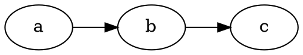
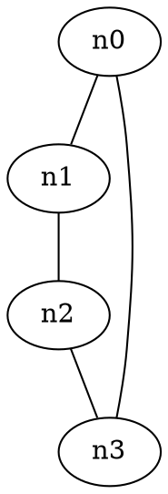
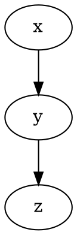
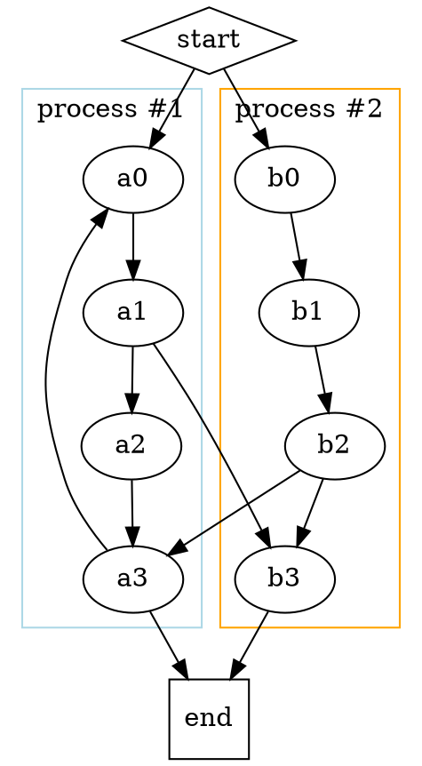

# [DOT (Graphviz)](https://observablehq.com/framework/lib/dot\#dot-graphviz)

[DOT](https://graphviz.org/doc/info/lang.html) is a language for expressing node-link diagrams using [Graphviz](https://graphviz.org/). Observable provides a `dot` tagged template literal powered by [Viz.js](https://github.com/mdaines/viz-js). This is available by default in Markdown, or you can import it like so:

```js
import dot from "npm:@observablehq/dot";
```

To use in a JavaScript code block:

Gaabba->bccb->c

```js
dot`digraph G {
  rankdir = LR
  a -> b -> c
}`
```

You can also write DOT in a `dot` fenced code block:

````md

````

This produces:

Gaabba->bccb->c

Here are some more examples.

n0n0n1n1n0--n1n2n2n1--n2n3n3n2--n3n3--n0



xxyyx->yzzy->z



Gcluster\_0process #1cluster\_1process #2a0a0a1a1a0->a1a2a2a1->a2b3b3a1->b3a3a3a2->a3a3->a0endenda3->endb0b0b1b1b0->b1b2b2b1->b2b2->a3b2->b3b3->endstartstartstart->a0start->b0



If you don’t mind losing the conveniences of the built-in wrapper such as responsive light and dark mode, you can also use Viz.js directly. For example:

aabba--bccb--cc--a

```js
import {instance} from "npm:@viz-js/viz";

const viz = await instance();

display(
  viz.renderSVGElement({
    directed: false,
    edges: [\
      {tail: "a", head: "b"},\
      {tail: "b", head: "c"},\
      {tail: "c", head: "a"}\
    ]
  })
);
```
