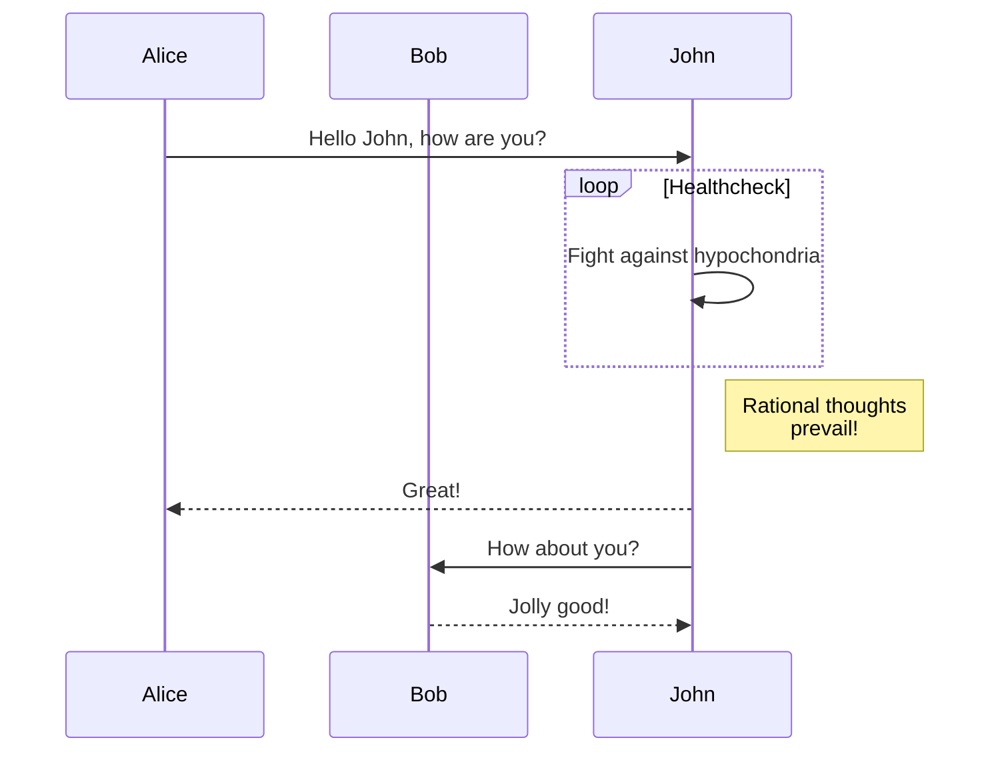
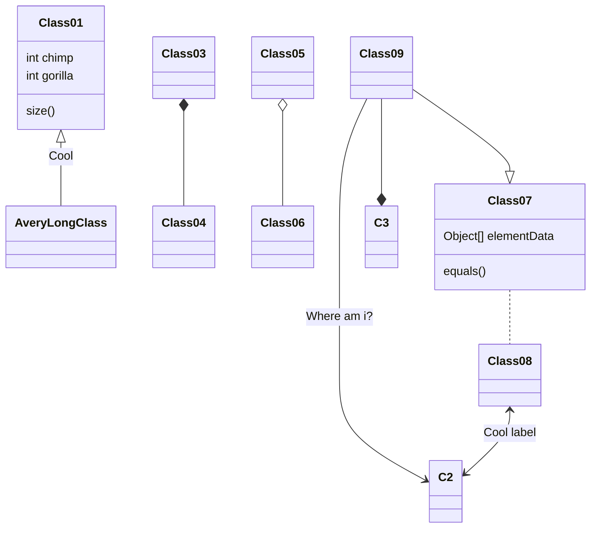

# [Mermaid](https://observablehq.com/framework/lib/mermaid\#mermaid)

[Mermaid](https://mermaid.js.org/) is a language for expressing node-link diagrams, flowcharts, sequence diagrams, and many other types of visualizations. (See also [DOT](https://observablehq.com/framework/lib/dot).) Observable provides a `mermaid` tagged template literal for convenience. This is available by default in Markdown, or you can import it like so:

```js
import mermaid from "npm:@observablehq/mermaid";
```

To use in a JavaScript code block:

A

B

C

D

```js
mermaid`graph TD;
    A-->B;
    A-->C;
    B-->D;
    C-->D;`
```

You can also write Mermaid in a `mermaid` fenced code block:

````md

````

This produces:

A

B

C

D

Here are some more examples.

JohnBobAliceJohnBobAliceloop\[Healthcheck\]Rational thoughts prevail!Hello John, how are you?Fight against hypochondriaGreat!How about you?Jolly good!



Cool

Where am i?

Cool label

Class01

int chimp

int gorilla

size()

AveryLongClass

Class03

Class04

Class05

Class06

Class07

Object\[\] elementData

equals()

Class08

Class09

C2

C3


